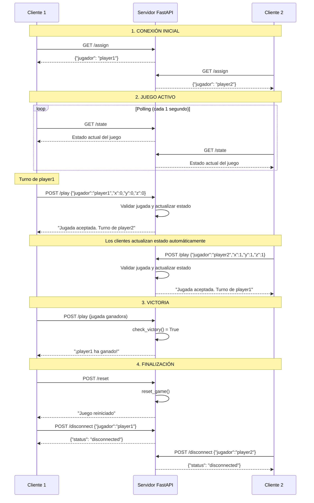

# Tic-Tac-Toe
Proyecto Semestral - Tic Tac Toe

## **RESUMEN DE CAMBIOS PRINCIPALES:**

1. **Arquitectura Cliente-Servidor**: El juego original está toda la lógica en un archivo, ahora tiene separación clara entre cliente y servidor.

2. **Estado Compartido**: El servidor mantiene el estado único del juego que todos los clientes ven y modifican.

3. **Comunicación HTTP**: Reemplaza las llamadas a funciones locales por peticiones a una API REST.

4. **Múltiples Jugadores**: Soporta dos jugadores conectados desde diferentes máquinas.

5. **Sincronización**: El cliente actualiza periódicamente el estado desde el servidor.

6. **Gestión de Conexiones**: El servidor controla qué jugadores están conectados y asigna turnos.

7. **Validación en Servidor**: Toda la lógica de validación de jugadas se mueve al servidor para evitar trampas.

8. **Persistencia de Estado**: El juego continúa aunque un cliente se desconecte temporalmente.

## **DIAGRAMA DE SECUENCIA DEL JUEGO TIC-TAC-TOE CLIENTE-SERVIDOR**




# 📖 Guía: Servidor FastAPI en LAN con Uvicorn

## Modificar la IP que escucha Uvicorn
Por defecto, Uvicorn escucha en `127.0.0.1` (solo accesible desde tu propio PC).  
Para que otros dispositivos de tu red puedan conectarse:

- Lanza el servidor con:
  ```bash
  uvicorn Servidor.server:app --host 0.0.0.0 --port 8000
  ```
- Para instalar uvicorn:
  ```bash
  pip install uvicorn
  ```
- también asegúrate de tener FastAPI:
  ```bash
  pip install fastapi uvicorn
  ```
- Explicación:
  - `server:app` → tu archivo `server.py` y la instancia `app`.
  - `--host 0.0.0.0` → escucha en todas las interfaces de red (LAN incluida).
  - `--port 8000` → puerto de acceso (puedes usar otro si prefieres).

Ahora tu servidor está accesible desde cualquier dispositivo de la LAN usando la IP de tu PC.  
Ejemplo: `http://192.168.1.50:8000`.

---

## 2️⃣ Comprobar tu IP LAN
Necesitas saber la IP de tu máquina en la red local:

- **Windows**:  
  Abre PowerShell y escribe:
  ```bash
  ipconfig
  ```
  Busca la sección de tu adaptador Wi-Fi/Ethernet → “Dirección IPv4”.

- **Linux/macOS**:  
  ```bash
  ifconfig
  ```
  o
  ```bash
  ip addr show
  ```
  Busca la IP en la interfaz activa (`192.168.x.x` o `10.x.x.x`).

---

## Configurar el firewall
El firewall puede bloquear conexiones externas al puerto 8000.  
Debes abrir ese puerto para que otros dispositivos puedan entrar.

- **Windows Defender Firewall**:  
  - Al arrancar Uvicorn, suele preguntar si quieres permitir conexiones.  
  - Marca “Red privada” (LAN doméstica).  
  - Si no aparece, abre manualmente el puerto:
    1. Panel de Control → Sistema y seguridad → Firewall de Windows → Configuración avanzada.
    2. Reglas de entrada → Nueva regla → Puerto → TCP 8000 → Permitir conexión → Red privada.


- **Linux (UFW)**:  
  ```bash
  sudo ufw allow 8000/tcp
  ```

- **macOS**:  
  - Preferencias del sistema → Seguridad y privacidad → Firewall → Opciones → añade Python/Uvicorn como excepción.

---

## Probar la conexión
- Desde otro dispositivo de la LAN, abre un navegador y escribe:
  ```
  http://192.168.1.50:8000/state
  ```
  (cambia la IP por la de tu PC).
- Si ves la respuesta JSON del servidor, ¡ya está funcionando en LAN!  
- Tus clientes Tkinter solo necesitan cambiar:
  ```python
  SERVER_URL = "http://192.168.1.50:8000"
  ```

---

## Resumen
1. Arranca Uvicorn con `--host 0.0.0.0`.  
2. Comprueba tu IP LAN (`ipconfig` o `ifconfig`).  
3. Abre el puerto en el firewall (8000).  
4. Conecta los clientes usando `http://<tu-IP>:8000`.
